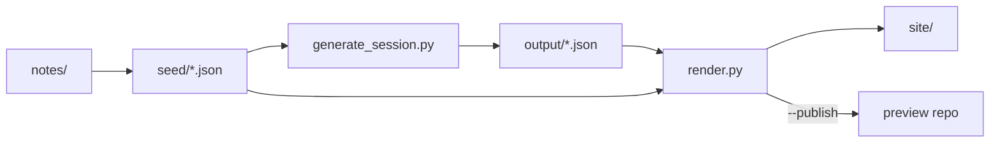
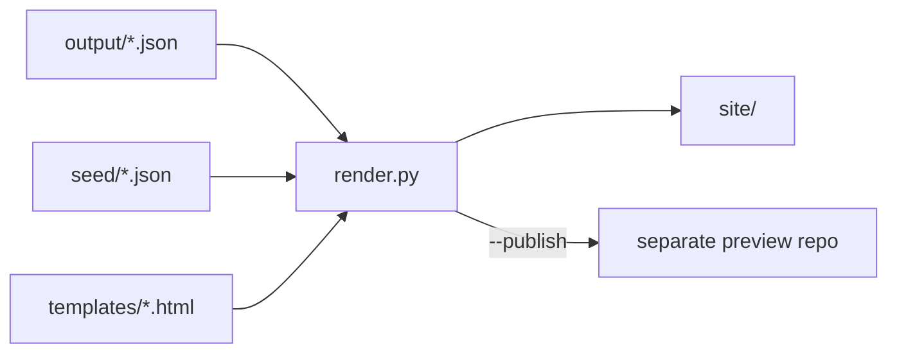

# The Global Speaker — Implementation Plan (Executed)

This document records the plan that was executed to build the Global Speaker content pipeline: from source documentation and seeds, through AI-generated session blueprints, to a static HTML site published on GitHub Pages.

**Source repository:** [github.com/lauro-eio/global-speaker](https://github.com/lauro-eio/global-speaker)

---

## Overview

The system has three stages:

1. **Seeds** — Structured JSON derived from cleaned-up notes (persona, template, syllabus).
2. **Generation** — Gemini produces session blueprints as JSON from level + session inputs.
3. **Rendering** — Jinja2 templates turn JSON into a static site for GitHub Pages (separate preview repo).



---

## Phase 1 — Environment

| Item | Detail |
|------|--------|
| Python venv | `.venv/` (Python 3.14) |
| Secrets | `.env` with `GEMINI_API_KEY`, `GEMINI_MODEL` |
| Example config | `.env.example` |
| Ignored | `.env`, `.env.conf`, `.venv/`, `output/`, `site/` |

**Setup:**

```powershell
python -m venv .venv
.\.venv\Scripts\Activate.ps1
pip install -r requirements.txt
cp .env.example .env   # then set GEMINI_API_KEY
```

---

## Phase 2 — Notes cleanup and seed files

Three note files were cleaned (formatting, typos, consistent markdown) and converted into JSON seeds in `seed/`.

| Notes file | Seed file | Purpose |
|------------|-----------|---------|
| `notes/System Persona & Mandate.txt` | `seed/system-persona-mandate.json` | AI role, philosophies, output rules |
| `notes/Strict Master Output Template.txt` | `seed/strict-master-output-template.json` | 8-section blueprint schema (I–VIII) |
| `notes/global speaker syllabus` | `seed/global-speaker-syllabus.json` | 27 chapters across 3 levels |

**Syllabus seed structure:** 3 levels × 9 chapters, each with `global_chapter_number` (1–27), `key_ability`, and `work_ready_drill`.

**Template seed structure:** Section IDs I–VIII with keyed fields, labels, and placeholders used for both generation validation and HTML rendering.

---

## Phase 3 — Session blueprint generation

**Script:** `generate_session.py`

**Input:** Interactive or CLI — level (1–3) and session/chapter (1–9).

**Process:**

1. Load persona, template, and syllabus seeds.
2. Resolve the target chapter from the syllabus.
3. Call Gemini with structured JSON output matching the template schema.
4. Validate all sections and required fields.
5. Write to `output/level-{N}-session-{M}-{slug}.json`.

**Usage:**

```powershell
python generate_session.py                  # interactive
python generate_session.py --level 1 --session 1
```

**Output JSON shape:**

```json
{
  "id": "level-1-session-1-the-professional-intro",
  "template_ref": "strict-master-output-template",
  "session": { "level", "chapter_title", "key_ability", "work_ready_drill", ... },
  "blueprint": {
    "header": { "chapter_title", "level", "focus" },
    "sections": { "I": {...}, "II": {...}, ... "VIII": {...} }
  }
}
```

**Dependencies:** `python-dotenv`, `google-genai`

---

## Phase 4 — HTML render for GitHub Pages

**Script:** `render.py`

**Goal:** Convert `output/*.json` into a browsable static site, staged for a **separate** GitHub Pages repository.

### Architecture



### Source repo layout (this project)

```
global_speaker/
├── output/                    # JSON blueprints (gitignored)
├── seed/
│   ├── strict-master-output-template.json
│   └── global-speaker-syllabus.json
├── templates/
│   ├── base.html
│   ├── session.html
│   ├── level_index.html
│   └── program_index.html
├── assets/
│   └── style.css
├── render.py
└── site/                      # generated static site (gitignored)
```

### Published site layout (preview repo)

```
global-speaker-preview/        # PREVIEW_REPO_PATH in .env
├── index.html
├── assets/style.css
├── level-1/
│   ├── index.html
│   └── session-1-the-professional-intro.html
├── level-2/ ...
└── level-3/ ...
```

All links use **relative paths** so GitHub Pages works at any base URL.

### Render steps

1. Load template seed for field key → label mapping.
2. Load syllabus seed for the full 27-session navigation tree.
3. For each `output/*.json`, render `session.html` → `site/level-{N}/session-{M}-{slug}.html`.
4. Generate per-level indexes: `site/level-{N}/index.html`.
5. Generate program index: `site/index.html` (all 27 slots; links where JSON exists, “pending” otherwise).
6. Copy `assets/style.css` → `site/assets/style.css`.

### Session page structure

Matches `notes/Strict Master Output Template.txt`:

- Header: chapter title, level, focus badge
- Meta: global chapter #, key ability, drill name, generated date
- Sections I–VIII as `<section>` blocks
- Section IV: “80% of Session Duration” callout
- Section V: numbered success-metrics checklist
- `key_linguistic_triggers`: bullet list
- Breadcrumbs: Home → Level N → Session title

### CLI

```powershell
python render.py
python render.py --file output/level-1-session-1-the-professional-intro.json
python render.py --publish
python render.py --publish --commit --push
```

**Publish mode:**

- Copies `site/` → `PREVIEW_REPO_PATH` (set in `.env`, e.g. `../global-speaker-preview`)
- `--commit` / `--push` run git in the preview repo only when explicitly passed

**Dependencies:** `jinja2` (added to `requirements.txt`)

### GitHub Pages setup (preview repo, one-time)

1. Push rendered site contents to `main`.
2. Repository **Settings → Pages** → deploy from branch `main`, folder `/ (root)`.
3. Site URL: `https://<user>.github.io/<preview-repo>/`

---

## End-to-end workflow

```powershell
# 1. Generate a blueprint
python generate_session.py --level 1 --session 2

# 2. Build local site
python render.py

# 3. Preview locally
start site/index.html

# 4. Publish to GitHub Pages (when preview repo exists)
python render.py --publish --commit --push
```

---

## Validation (completed)

- [x] Level 1 Session 1 JSON generated with all 8 template sections
- [x] Rendered HTML includes header, meta, sections I–VIII with correct labels
- [x] Root index lists all 27 syllabus slots (1 linked, 26 pending)
- [x] Relative asset paths work from nested level folders
- [x] Source repo pushed to GitHub (`lauro-eio/global-speaker`); secrets and generated artifacts excluded

---

## What stays local vs published

| Path | Committed to source repo | Published to preview repo |
|------|--------------------------|---------------------------|
| `notes/`, `seed/`, scripts, templates | Yes | No |
| `.env`, API keys | No | No |
| `output/*.json` | No | No |
| `site/` (HTML/CSS) | No | Yes (via `--publish`) |

---

## Optional follow-ups (not implemented)

- Print `python render.py` hint from `generate_session.py` after each save
- Automate preview deploy via GitHub Actions
- Batch-generate all 27 sessions
